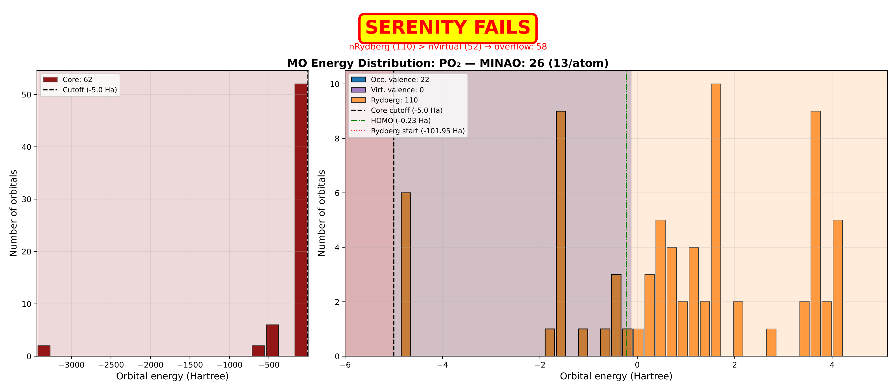
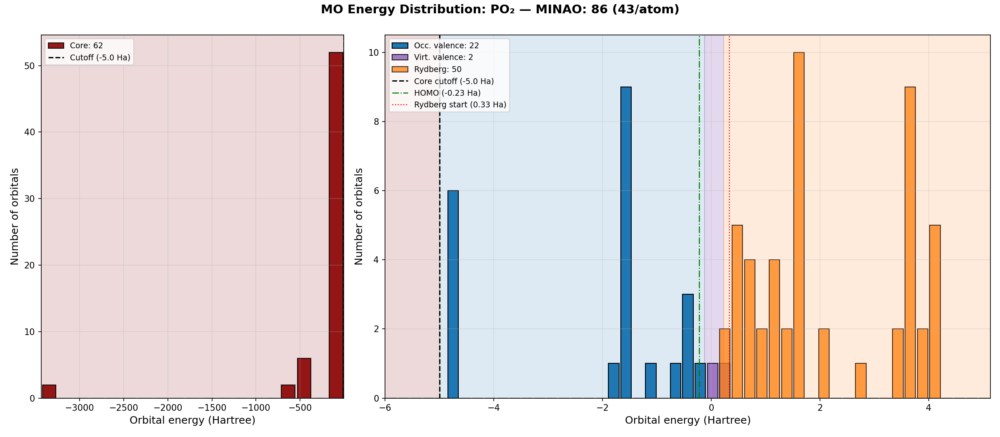

# autoCAS4HE - autoCAS for Heavy Elements

This repository provides patched versions of [Serenity](https://github.com/qcserenity/serenity) and [autoCAS](https://github.com/qcscine/autocas) that enable automated active space selection for heavy element systems (Z > 36) using relativistic orbitals from OpenMolcas.

**Status**: IBO localization works for heavy elements via two complementary fixes: (1) an energy-based Rydberg classification replacing the broken MINAO-count method, and (2) an expanded MINAO basis generated from ANO-RCC contracted functions for all elements Z >= 37, satisfying the IAO constraint `nMINAO >= nOcc`. Both are implemented in Serenity on the `heavy-elements-support` branch. The end goal is SO-CASSI / SO-MPSSI dissociation profiles for Po-containing molecules with autoCAS-selected active spaces.

Related issues:
- [qcserenity/serenity#18](https://github.com/qcserenity/serenity/issues/18)
- [qcscine/autocas#18](https://github.com/qcscine/autocas/issues/18)

---

## Pipeline Overview

Heavy elements require scalar relativistic Hamiltonians (DKH2) that Serenity does not support. The solution is to use OpenMolcas for the SCF step and feed those orbitals into Serenity for localization:

```
OpenMolcas (DKH2 SCF)
    → Serenity (IBO localization with expanded MINAO + energy-based Rydberg cutoff)
        → autoCAS (DOS orbital mapping + S1 plateau detection)
            → OpenMolcas (CASSCF/DMRGSCF with autoCAS-selected CAS)
                → OpenMolcas (SO-CASSI / SO-MPSSI)
                    → Dissociation profiles with spin-orbit coupling
```

---

## Problems Identified and Fixed

### Serenity Patches

#### 1. Custom basis set support (`BasisFunctionProvider.cpp`, `SystemController.cpp`)
Serenity only searched a single directory for basis sets and silently fell back to CC-PVDZ when a basis was not found. Added `SERENITY_BASIS_PATH` environment variable support with colon-separated search paths and proper error messages.

#### 2. Primitive limit increase (`Libint.h`)
`N_PRIM_MAX` was set to 23, but ANO-RCC basis sets for heavy elements require up to 25 primitives per basis function. Increased to 25 to prevent heap corruption during integral evaluation.

#### 3. IBO Rydberg overflow fix (`LocalizationTask.cpp`, `LocalizationTask.h`)
**Bug**: IBO localization determines Rydberg orbitals by counting `nRydberg = nBasis - nMINAO`. For heavy elements, the MINAO basis is small relative to the full basis (e.g. Po₂: MINAO = 26, basis = 136), so `nRydberg = 110` exceeds the number of virtual orbitals (52). The algorithm overflows into occupied orbitals, crashing with *"A core orbital is assigned to be virtual"*.

**Fix**: Replaced the MINAO-count-based Rydberg classification with an energy-based cutoff. Orbitals with eigenvalues above a threshold are classified as Rydberg:
- s/p-block elements (no d orbitals): 0.5 Ha
- d-block elements (transition metals, Z >= 21): 1.0 Ha
- Auto-detected from atom types; user-overridable via `rydbergEnergyCutoff` setting

The old MINAO-count behavior is still available by setting `useRydbergEnergyRefinement = false`.

#### 4. Energy-based Rydberg classification (`OrbitalController.cpp`, `OrbitalController.h`)
Added `refineRydbergOrbitalsByEnergyCutOff()` method that classifies Rydberg orbitals based on eigenvalue energy rather than MINAO function count, with Python bindings in `LocalizationTask_python.cpp`.

#### 5. MINAO basis expansion for heavy elements (`data/basis/MINAO`)
The original MINAO for heavy elements (Z >= 37) only included valence shells (e.g. Po: 13 functions/atom), causing `nMINAO < nOcc` and breaking the IAO projection. Expanded the MINAO by extracting the first N contracted functions per angular momentum from ANO-RCC, where N = number of occupied shells. This is validated by Knizia (JCTC 2013, Table 1, footnote d) as a suitable MINAO source. The expansion covers elements Z = 37 (Rb) through Z = 96 (Cm). For Po: MINAO grows from 13 to 43 functions/atom (6s + 5p + 3d + 1f). Generated via `scripts/generate_heavy_MINAO.py`.

The mixed MINAO (cc-pVTZ for Z <= 36, ANO-RCC for Z >= 37) was analyzed and confirmed safe -- see [research/localization/MIXED_MINAO_BASIS_ANALYSIS.md](research/localization/MIXED_MINAO_BASIS_ANALYSIS.md). Disclaimer: Under review.

#### 6. IBO localization check relaxation (`IBOLocalization.cpp`)
The check at line 76 compared virtual orbital indices against `nMINAO`, but virtual indices naturally exceed `nMINAO` since they index into the full coefficient matrix. Relaxed the check to only apply for occupied-only localization (`!localizeVirtuals`), allowing the existing `replaceVirtuals` reconstruction logic to handle the mismatch.

#### 7. IAO reconstruction guard (`IAOPopulationCalculator.cpp`)
Added a guard against `nOcc >= nMINAO` in `reconstructVirtualValenceOrbitalsInplace()` to prevent unsigned integer underflow. With the expanded MINAO this should not trigger, but the guard provides a clear error message if the MINAO for an element is incomplete.

### autoCAS Patches

#### 1. Basis set typo fix (`configuration.py`)
The key `"basis_set_set"` was used instead of `"basis_set"` in `get_serenity_interface_settings()`, causing the `-b` command line option to be silently ignored and always falling back to CC-PVDZ.

#### 2. External orbital workflow (`protocol.py`, `configuration.py`)
Added `-e/--external-orbitals` and `-o/--orbital-files` CLI options to load pre-computed orbitals (e.g. from OpenMolcas DKH2 SCF) instead of running Serenity's non-relativistic SCF. This is essential for heavy elements where Serenity's non-relativistic treatment gives wrong orbital energies (~9640 Ha error for Po₂).

#### 3. Localization method selection (`protocol.py`, `configuration.py`)
Added `-L/--localization` CLI option to choose between localization methods:
| Method | Flag | MINAO required? | Notes |
|--------|------|-----------------|-------|
| IBO | `-L IBO` | Yes (default) | Basis-independent, preferred |
| Pipek-Mezey | `-L PIPEK_MEZEY` | No | More basis-set dependent |
| Foster-Boys | `-L BOYS` | No | Spatial extent minimization |
| Edmiston-Ruedenberg | `-L EDMINSTON_RUEDENBERG` | No | Coulomb self-repulsion |
Disclaimer: Alternatives for IBO resulted in errors. Further investigation is not a priority given that IBO now works and, for all practical purposes, seems superior. 

#### 4. Force CAS option (`protocol.py`, `configuration.py`, `run_autocas.py`)
Added `-f/--force-cas` CLI option to bypass the `SingleReferenceException` that can occur with certain localization methods, forcing autoCAS to continue with CAS selection regardless.

#### 5. IBO distribution plotting (`workflow.py`, `serenity.py`)
autoCAS now generates IBO energy distribution plots alongside the standard entanglement diagrams, showing the core/valence/Rydberg orbital classification. These plots help diagnose IBO issues for new systems.

#### 6. Rydberg cutoff pass-through (`serenity.py`)
Added `rydberg_energy_cutoff` setting to the Serenity interface, passing the energy cutoff through to Serenity's localization task settings.

---

## IBO Localization for Heavy Elements

The core challenge for heavy element support is that Serenity's IBO (Intrinsic Bond Orbital) localization makes assumptions that break down for high-Z atoms.

### The Problem

IBO uses a minimal basis (MINAO) to distinguish valence from Rydberg orbitals. For light elements (Z <= 36), the MINAO basis in Serenity includes all shells (derived from cc-pVTZ). For heavy elements (Z >= 39), the MINAO only includes valence shells, making it much smaller relative to the full basis set and the number of occupied orbitals.

For Po₂ with ANO-RCC-VDZP:
| Property | Value |
|----------|-------|
| Basis functions | 136 |
| MINAO functions | 26 (13/atom, valence only) |
| Occupied orbitals | 84 |
| Virtual orbitals | 52 |
| MINAO-based nRydberg | 110 (overflows into occupied!) |

### Progression of IBO Fixes

The three plots below show the progression of fixes applied to Po₂ IBO localization:

#### 1. Original Serenity (broken) — MINAO: 26 (13/atom)

With the default valence-only MINAO, `nRydberg = nBasis - nMINAO = 136 - 26 = 110`, which overflows into the occupied space (only 52 virtuals). Serenity crashes in `splitValenceAndCore`:



#### 2. Energy-based Rydberg cutoff (intermediate fix)

Replacing the MINAO-count Rydberg classification with an energy-based cutoff (E >= 1.0 Ha for p-block) eliminates the overflow. 15 virtual valence orbitals are now available for excited state calculations. However, `nMINAO (26) < nOcc (84)` still causes the IAO projection to be rank-deficient:


#### 3. Current implementation — MINAO: 86 (43/atom)

After expanding the MINAO basis with ANO-RCC contracted functions for all occupied shells, `nMINAO (86) >= nOcc (84)` is satisfied. The IAO projection is well-conditioned, and IBO localization completes successfully with 2 virtual valence orbitals:



### PSE Dimer Study

A systematic study across 61 homonuclear dimers (H–Po) was conducted to validate the energy-based cutoff. Results from `tests/IBO_dimer_study/`:

| Category | Count | Description |
|----------|-------|-------------|
| IBO OK | 18 (30%) | H, Be, C, N, F, Li, Na, Mg, K, Ca, P, Cl, As, Br, Cr, Mn, Cu, Zn |
| SCF convergence issues | 32 (52%) | Positive HOMO (unbound electrons) — wrong spin multiplicity |
| Rydberg overflow | 11 (18%) | Ag, At, Au, Bi, Cd, Hg, I, Mo, Po, Sb, W — **all fixed by energy cutoff** |

### MINAO Expansion Fix (Implemented)

The energy-based Rydberg cutoff alone is not sufficient: the IAO construction projects all occupied MOs onto the MINAO space, and when `nMINAO < nOcc` (26 < 84 for Po₂), the projection is rank-deficient. This was fixed by expanding the MINAO basis for heavy elements (Z >= 37) using ANO-RCC contracted functions to include all occupied shells (core + valence).

After expansion, Po₂ numbers become:
| Property | Before | After |
|----------|--------|-------|
| MINAO functions | 26 (13/atom) | 86 (43/atom) |
| nMINAO >= nOcc? | No (26 < 84) | Yes (86 > 84) |
| Virtual valence (IAO) | N/A (crashed) | 2 |

The expanded MINAO was validated safe for autoCAS across target molecules ([AUTOCAS_EXPANDED_MINAO_COMPATIBILITY.md](research/localization/AUTOCAS_EXPANDED_MINAO_COMPATIBILITY.md)):

| Molecule | nMINAO | nOcc | nValVirt (IAO) | Status |
|----------|--------|------|----------------|--------|
| Po₂ | 86 | 84 | 2 | OK (minimal) |
| Po(OH)₂ | 55 | 51 | 4 | OK |
| Po(OH)₄ | 67 | 60 | 7 | OK |
| PoPb | 86 | 83 | 3 | OK |
| PoBi | 86 | 83-84 | 2-3 | OK |

The CAS size, DMRG cost, and S1 plateau detection are unaffected by the MINAO expansion -- these are determined by autoCAS's `Elements` class (chemical knowledge), not by MINAO. The MINAO only affects IBO localization quality.

**Known limitation**: The number of IBO-localizable virtual valence orbitals is tight for homonuclear heavy dimers (2 for Po₂). This is inherent to the IAO framework when `nOcc` is close to `nMINAO`. Larger molecules with light atoms (e.g. Po(OH)₄) have more headroom. See [IBO_MINAO_FIX_PLAN_290126.md](research/localization/IBO_MINAO_FIX_PLAN_290126.md) for the full analysis.

---

## Benchmark: Serenity vs OpenMolcas for Po₂

| Code | Time | Energy (Ha) | Relativistic |
|------|------|-------------|--------------|
| OpenMolcas | 2.25 min | -44341.68 | DKH2 |
| Serenity | 288 min (4.8 hrs) | -34701.36 | Non-relativistic |

OpenMolcas is ~128x faster and gives correct energies with scalar relativistic treatment. See [tests/RHF_BENCHMARK_COMPARISON.md](tests/RHF_BENCHMARK_COMPARISON.md).

---

## Repository Structure

```
autoCAS4HE/
├── serenity/                          # Patched Serenity (submodule, heavy-elements-support branch)
├── autocas/                           # Patched autoCAS (submodule, heavy-elements-support branch)
├── tests/
│   ├── custom_basis/                  # Custom basis sets (ANO-RCC-VDZP, etc.)
│   ├── serenity/
│   │   └── Po2_RHF_benchmark/         # Serenity RHF timing benchmark
│   ├── molcas/
│   │   └── Po2_RHF_benchmark/         # OpenMolcas RHF timing benchmark (DKH2)
│   ├── autocas/
│   │   ├── serenity_scf/              # Standard workflow tests (Serenity SCF)
│   │   │   ├── N2_test/               # N2 with CC-PVDZ
│   │   │   ├── N2_ANO_test/           # N2 with ANO-RCC-VDZP
│   │   │   └── Po2_test/              # Po2 test (crashed — IBO issue)
│   │   ├── external_scf/              # External orbital workflow tests
│   │   │   ├── N2_test/               # N2 with OpenMolcas orbitals
│   │   │   ├── Po2_test/              # Po2 with DKH2 orbitals
│   │   │   └── Po2_IBO_fix_test/      # IBO distribution plots for Po2
│   │   └── localization_methods/      # Alternative localization tests
│   │       ├── Po2_PM/                # Pipek-Mezey test
│   │       └── Po2_FB/                # Foster-Boys test
│   └── IBO_dimer_study/               # PSE-wide IBO analysis (61 dimers)
├── research/                          # Research notes and analysis
│   ├── PO2_AUTOCAS_ERROR_ANALYSIS.md
│   ├── localization/                  # IBO/MINAO research for heavy elements
│   └── relativistic/                  # Relativistic treatment research
├── scripts/
│   ├── IBO_distr.py                   # IBO distribution visualization
│   ├── create_IBO_gif.py              # PSE animation generator
│   ├── analyze_rydberg_cutoff.py      # Rydberg cutoff analysis
│   ├── generate_heavy_MINAO.py        # MINAO expansion from ANO-RCC (Z >= 37)
│   ├── count_MINAO.py                 # MINAO basis function counter
│   ├── dimer_data.py                  # Bond lengths and spin data
│   └── generate_dimer_tests.sh        # Test directory generator
├── docs/
│   ├── ENVIRONMENT_SETUP.md           # Local/WSL environment setup
│   ├── HPC_BUILD_HORTENSE.md          # HPC build guide for VSC Hortense
│   ├── next_steps.md                  # Development roadmap
│   └── session_notes/                 # Daily session logs
├── setup_autocas_env.sh               # Environment setup (local/WSL)
├── setup_hortense.sh                  # Environment setup (HPC Hortense)
├── job_template.pbs                   # PBS job template (HPC)
└── serenity-heavy-elements.patch      # Original Serenity patch
```

---

## Quick Start

### 1. Clone with submodules

```bash
git clone --recurse-submodules https://github.com/Joachim-S160/autoCAS4HE.git
cd autoCAS4HE
```

### 2. Build Serenity

```bash
cd serenity
mkdir build && cd build
cmake -G Ninja .. \
  -DSERENITY_PYTHON=ON \
  -DSERENITY_PYTHON_BINDINGS=ON \
  -DBUILD_TESTING=OFF \
  -DCMAKE_BUILD_TYPE=Release \
  -DCMAKE_INTERPROCEDURAL_OPTIMIZATION=OFF \
  -DCMAKE_CXX_FLAGS="-O2 -g0 -fno-lto -pipe"
ninja -j1
cd ../..
```

### 3. Set up environment

```bash
source setup_autocas_env.sh
```

Or manually:
```bash
source /path/to/autocas_env/bin/activate
export SERENITY_RESOURCES="/path/to/serenity/data/"
export SERENITY_BASIS_PATH="/path/to/custom/basis:/path/to/serenity/data/basis/"
export LD_LIBRARY_PATH="/path/to/serenity/build/lib:$LD_LIBRARY_PATH"
export PATH="/path/to/serenity/bin:$PATH"
```

### 4. Run a test (light elements — standard workflow)

```bash
cd tests/autocas/serenity_scf/N2_test
scine_autocas_consistent_active_space -i 1 n2_0.xyz n2_1.xyz
```

### 5. Run a test (heavy elements — external orbital workflow)

```bash
# First: run OpenMolcas DKH2 SCF to generate .scf.h5 files
# Then: use external orbitals with autoCAS
cd tests/autocas/external_scf/Po2_test
scine_autocas_consistent_active_space \
  -e -o po2_0.scf.h5,po2_1.scf.h5 \
  -b ANO-RCC-VDZP \
  -f \
  po2_0.xyz po2_1.xyz
```

CLI flags:
| Flag | Description |
|------|-------------|
| `-e` | Use external orbitals (skip Serenity SCF) |
| `-o` | Comma-separated list of orbital files (.scf.h5) |
| `-b` | Basis set name |
| `-L` | Localization method (IBO, PIPEK_MEZEY, BOYS, EDMINSTON_RUEDENBERG) |
| `-f` | Force CAS selection even if system appears single-reference |
| `-i` | Number of DMRG iterations |

---

## Verified Tests

### Light Elements (N₂)

| Test | Basis | Active Space | Energies (a.u.) |
|------|-------|--------------|-----------------|
| N₂ Serenity SCF | CC-PVDZ | CAS(6,6) | -109.25 / -108.94 |
| N₂ Serenity SCF | ANO-RCC-VDZP | CAS(6,6) | -109.36 / -109.04 |
| N₂ External SCF | CC-PVDZ | CAS(6,6) | -109.25 / -108.94 |

### Heavy Elements (Po₂)

| Test | Status | Notes |
|------|--------|-------|
| Po₂ Serenity SCF (standard) | Crashed | IBO Rydberg overflow |
| Po₂ External SCF + IBO | In progress | Energy-based Rydberg cutoff applied |
| Po₂ External SCF + Foster-Boys | NaN orbitals | Subsystem partitioning corruption |
| Po₂ External SCF + Pipek-Mezey | NaN orbitals | Same subsystem issue |

N₂ geometries: 1.1 A (equilibrium) and 4.1 A (dissociated). HPC build uses GCC 12.3.0 (Intel icpx has compiler bugs with Serenity).

---

## Custom Basis Sets

Custom basis sets are stored in `tests/custom_basis/` and included via `SERENITY_BASIS_PATH`.

**Included:**
- `ANO-RCC-VDZP` — All-electron relativistic basis for heavy elements

**Adding new basis sets:**
1. Place file in `tests/custom_basis/`
2. Filename must match basis name exactly (e.g., `ANO-RCC-VTZP`)
3. Format: Turbomole format

---

## Bug Timeline

| Date | Bug | Severity | Fix |
|------|-----|----------|-----|
| Jan 21 | `basis_set_set` typo in autoCAS — `-b` flag silently ignored | High | Changed key to `basis_set` in `configuration.py` |
| Jan 21 | `N_PRIM_MAX=23` too low for ANO-RCC — heap corruption | Critical | Increased to 25 in `Libint.h` |
| Jan 21 | Serenity single basis search path — no custom basis support | Medium | Added `SERENITY_BASIS_PATH` env var |
| Jan 24 | IBO core/virtual crash for Po₂ — Rydberg overflow | Critical | Energy-based Rydberg cutoff in `LocalizationTask.cpp` |
| Jan 26 | `.ScfOrb` files missing eigenvalues — Serenity needs `.scf.h5` | Medium | Fixed `protocol.py` to copy HDF5 files |
| Jan 27 | NaN orbital coefficients from `splitValenceAndCore` subsystems | Critical | Likely resolved — related to alternative localization methods issue |
| Jan 27 | `SingleReferenceException` with FB localization | Medium | Added `-f/--force-cas` CLI option |
| Jan 28 | MINAO basis too small for heavy elements (26 < 84 occupied) | Critical | Expanded MINAO from ANO-RCC (`generate_heavy_MINAO.py`), relaxed IBOLocalization check, added IAO reconstruction guard |
| Jan 29 | MINAO expansion implementation and compatibility analysis | — | Generated ANO-RCC MINAO for Z = 37–96 (`generate_heavy_MINAO.py`), validated compatibility with autoCAS (CAS size, DMRG, DOS, larger molecules), analyzed mixed cc-pVTZ/ANO-RCC MINAO safety |
| Jan 30 | Serenity submodule updated with all IBO fixes | — | Applied MINAO expansion + IBOLocalization relaxation + IAO guard to Serenity `heavy-elements-support` branch, Po₂ IBO localization now completes, added scaling test (25 geometries), comprehensive README documentation |

---

## Documentation

- [docs/ENVIRONMENT_SETUP.md](docs/ENVIRONMENT_SETUP.md) — Local/WSL setup instructions
- [docs/HPC_BUILD_HORTENSE.md](docs/HPC_BUILD_HORTENSE.md) — HPC build guide for VSC Tier-1 Hortense
- [docs/next_steps.md](docs/next_steps.md) — Development roadmap
- [docs/session_notes/](docs/session_notes/) — Daily session logs (Jan 21–30, 2026)
- [research/README.md](research/README.md) — Research documentation index
- [research/localization/IBO_MINAO_FIX_PLAN_290126.md](research/localization/IBO_MINAO_FIX_PLAN_290126.md) — MINAO expansion implementation plan
- [research/localization/AUTOCAS_EXPANDED_MINAO_COMPATIBILITY.md](research/localization/AUTOCAS_EXPANDED_MINAO_COMPATIBILITY.md) — Compatibility analysis (CAS size, DMRG, DOS, larger molecules)
- [research/localization/MIXED_MINAO_BASIS_ANALYSIS.md](research/localization/MIXED_MINAO_BASIS_ANALYSIS.md) — Mixed cc-pVTZ/ANO-RCC MINAO safety analysis
- [tests/README.md](tests/README.md) — Test directory overview

---

## Current Status and Next Steps

### Working
- Custom basis sets (ANO-RCC-VDZP) in Serenity
- External orbital workflow (OpenMolcas DKH2 → Serenity)
- Energy-based Rydberg classification for IBO
- Expanded MINAO basis for heavy elements (Z = 37–96, from ANO-RCC)
- IBOLocalization check relaxation and IAO reconstruction guard
- IBO distribution diagnostic plots
- N₂ full autoCAS workflow (both standard and external SCF)
- PSE dimer study framework (61 elements)
- Mixed MINAO basis validated (cc-pVTZ for Z <= 36, ANO-RCC for Z >= 37), disclaimer: NEEDS FURTHER REVIEW

### In Progress
- Po₂ end-to-end autoCAS test with expanded MINAO: scaling test for more geometries
- Active spaces appear relatively indifferent to using the `consistent_cas_algorithm` — possibly because autoCAS's chemically intuitive valence space is too restrictive. If confirmed, may need ROSE or larger MINAO to capture more virtual valence orbitals

### Future
- Verify compatibility with multistate DMRGSCF and CASSCF (state-averaged calculations)
- Investigate orbital mapping theory and unmappable orbitals in more detail
- Po₂ full autoCAS workflow with DMRG
- SO-CASSI / SO-MPSSI dissociation profiles
- ROSE software evaluation as alternative to Serenity for IAO/IBO (PySCF scalar-X2C path)
- Element-specific spin multiplicities for dimer study (not a priority)
- Expand default chemical valence for Po/Bi (include 5d in valence)
- Tunable bond dimension and sweeps parameters for `consistent_cas_algorithm`
- IBO plots don't include the nMINAO < nOCC + nVirtualValence constraint — extend nRydberg to satisfy IBO requirement, reducing nVirtualValence

---

## License

- Serenity: LGPL-3.0 ([license](https://github.com/qcserenity/serenity/blob/master/LICENSE))
- autoCAS: BSD-3-Clause ([license](https://github.com/qcscine/autocas/blob/master/LICENSE.txt))
